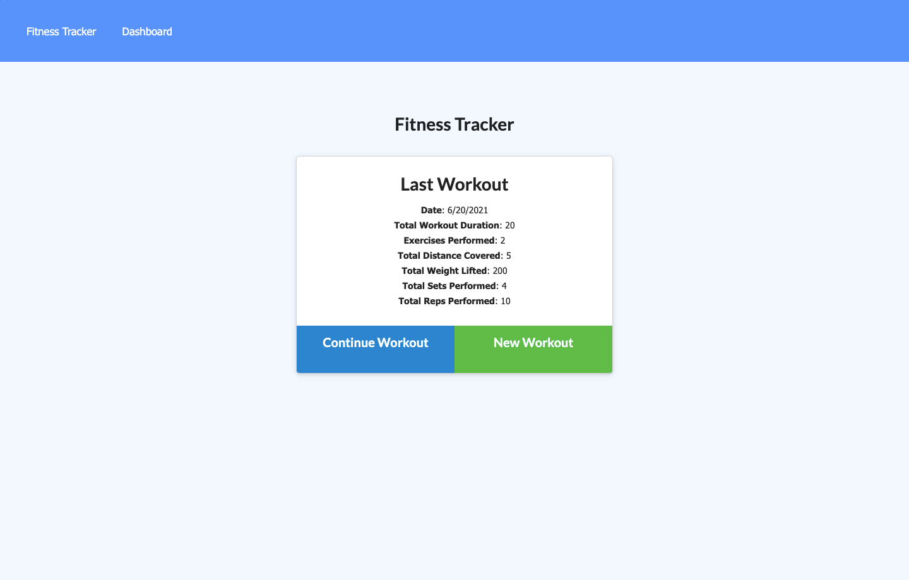
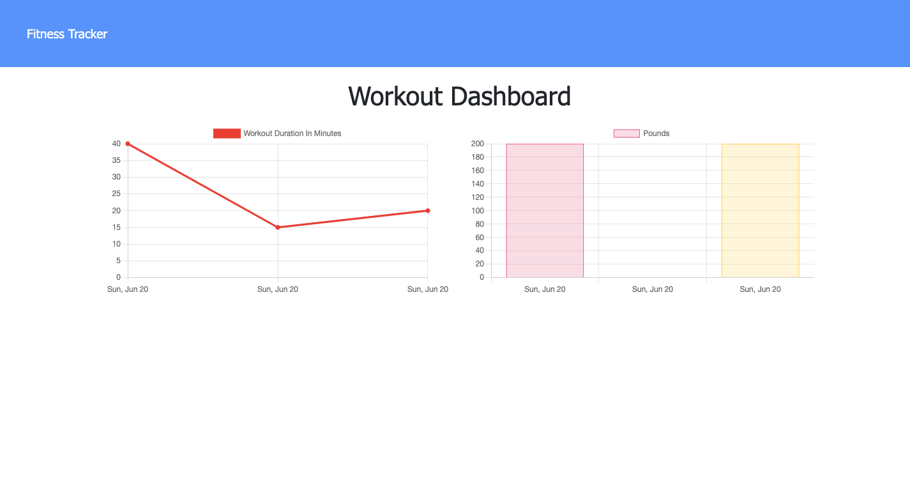

# Workout Tracker

## Description

Workout tracker using a Mongo database and a Mongoose schema

## Table of Contents
[Screenshots](https://github.com/sranson/workout-tracker#Screenshots)

[Deployed Site](https://github.com/sranson/workout-tracker#deployed-site)

[Questions](https://github.com/sranson/workout-tracker#Questions)

[Contributing](https://github.com/sranson/workout-tracker#Contributing)

[License](https://github.com/sranson/workout-tracker#License)

## Screenshots
 

 

## Deployed Site
[Developer Tech Blog](https://https://sar-workout-tracker.herokuapp.com/)

## Questions

[GitHub Profile](https://github.com/sranson)

Email: salomeranson@gmail.com

## Contributing

Salome Ranson

## License

[MIT](https://choosealicense.com/licenses/mit/)